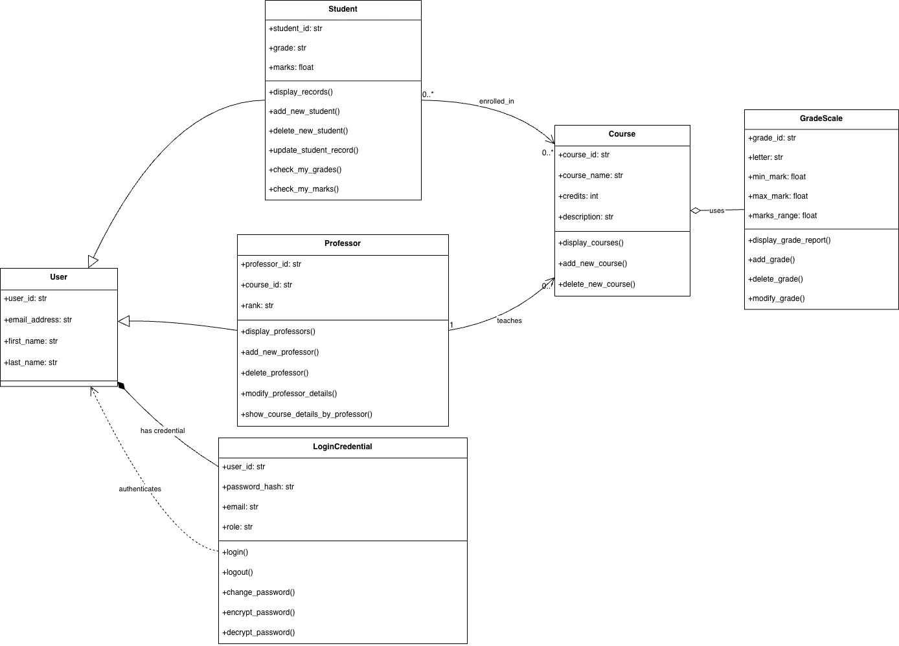

# Check-My-Grade-App

## Unit Testing
- Testing of student records addition/deletion and modification. Performing the test to have the
student files atleast 1000 records.
- Loading the data from previous runs saved in the csv files and loading the data
and search. Printing the time taken for search cases. 
- Test case to sort the student records (ascending/descending order) based on
marks or student email_address. Report includes the timing it took to sort the records. 
- Unit test to add/delete/modify the course , professor

### My Learning for Unit Testing:
- Learning about the unittest module. 
- Creating a test class. Here I created BasicTests class. 
- The test methods should start with a `test_`. 
- We write the code that will show the expected result, then compare it with the actual result using `assertion methods`.
- The function test_search_timing_basic() reads the students saved in file and searches based on email and id. 
- The time taken to search is printed by using the `time.perf_counter` function with timestamps taken at different sections (difference sorting orders). 
- (This allowed me to learn about the time.perf_count function and how to use it).
-
## Object Oriented Design (OOD) for CheckMyGrade Application

## UML Relationships (IS-A vs HAS-A)

### IS-A (Inheritance) — hollow triangle arrow (child → parent)
- **Student → User** : *Student IS-A User*
- **Professor → User** : *Professor IS-A User*

### HAS-A (Association / Composition) — solid line; diamond indicates composition/aggregation
- **User ──◆── LoginCredential** : *User HAS-A LoginCredential (Composition)*  
  ➤ Filled diamond → **Composition**: LoginCredential cannot exist without User.

- **Course ──◇── GradeScale** : *Course HAS-A GradeScale (Aggregation)*  
  ➤ Empty diamond → **Aggregation**: GradeScale is used by Course but can exist independently.

- **Student ──► Course** : *Student HAS-A / enrolled_in Course* (many courses per student)
- **Professor ──► Course** : *Professor HAS-A / teaches Course* (one or more courses)

**Legend**
- **▷** hollow triangle → inheritance (**IS-A**)  
- **──►** solid line with arrowhead → association (**HAS-A**)  
- **──◆──** filled diamond → composition (strong HAS-A)  
- **──◇──** empty diamond → aggregation (weak HAS-A)

